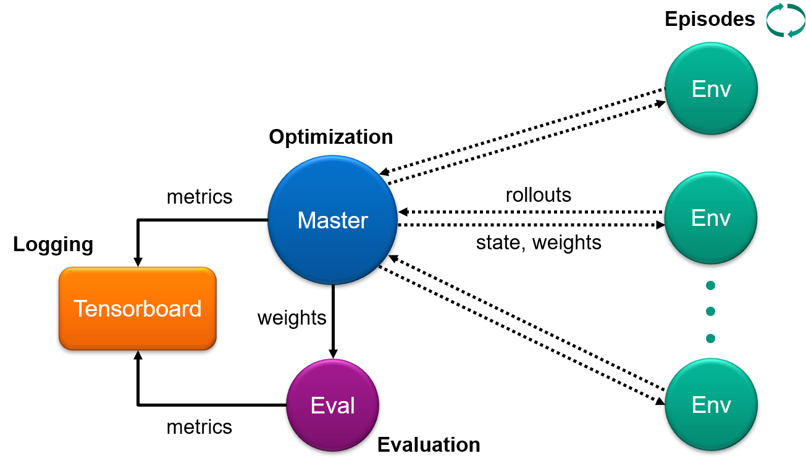

# Distributed PPO algorithm with the CARLA Reinforcement Learning Library

This library implements a distributed version of the [Proximal Policy Optimization](https://arxiv.org/pdf/1707.06347.pdf) algorithm and uses the [carla_rllib](https://github.com/50sven/carla_rllib) environment.
In addition, there is an older implementation of the [Asynchronous Actor-Critic](https://arxiv.org/pdf/1602.01783.pdf) which was not further developed.

To get started with the CARLA simulator, click
[here](https://carla.org/).

To get started with the CARLA reinforcment learning library, click
[here](https://github.com/50sven/carla_rllib).


## Prerequisites

1\. Follow the instructions [here](http://wiki.ros.org/ROS/Tutorials/catkin/CreateWorkspace) to create a catkin workspace.

2\. Clone this repository into the `src` folder of your catkin workspace:

```bash
cd catkin_ws/src
git clone https://github.com/50sven/ros_rl.git
```

3\. Build your package with `catkin_make`:

```bash
cd catkin_ws
source devel/setup.bash
catkin_make
```

**Note:** Every time you have made changes to the code, the package must be rebuilt.


## Get Started (with PPO)

1\. In order to start training, take a look at the following files:
- [`node_ppo.launch`](launch/node_ppo.launch): configurate the parameters of the algorithm and the environment
- [`setting.config`](scripts/setting.config): configurate the parameters regarding ROS and workstations used

2\. Start training with the bash script `train.sh`:
```bash
cd catkin_ws/src/ros_carla_rllib/scripts/
./train.sh
```

#### Idea:

* `train.sh` starts three types of nodes: MasterNode, EvalNode and EnvNode; as well as CARLA servers. Each node/server runs in its own tmux session.
* There is only one MasterNode and only one EvalNode per training.
* In contrast, there can be more than one EnvNode.
* EnvNodes and the EvalNode run their own `carla_rllib` environment, which is uniquely assigned to one carla server.
* There can be multiple trainings/nodes running on the same workstations (requires unique ports).


**Note:** The current implementation uses the trajectory environment from the [carla_rllib](https://github.com/50sven/carla_rllib) which was build for a specific use case.
In order to fit this implementation to individual needs one must adapted the [ppo implementation](nodes/ppo) and the [online evaluation](nodes/evaluation).


## Concept (of PPO)





#### Master:
- stores rollout data received from the environment nodes
- exectues PPO optimization steps
- logs training diagnostics

#### Environment:
- runs the policy in the environment to collect training data and sends it to the master

#### Evaluation:
- runs online evaluations during training
- logs evaluation metrics

